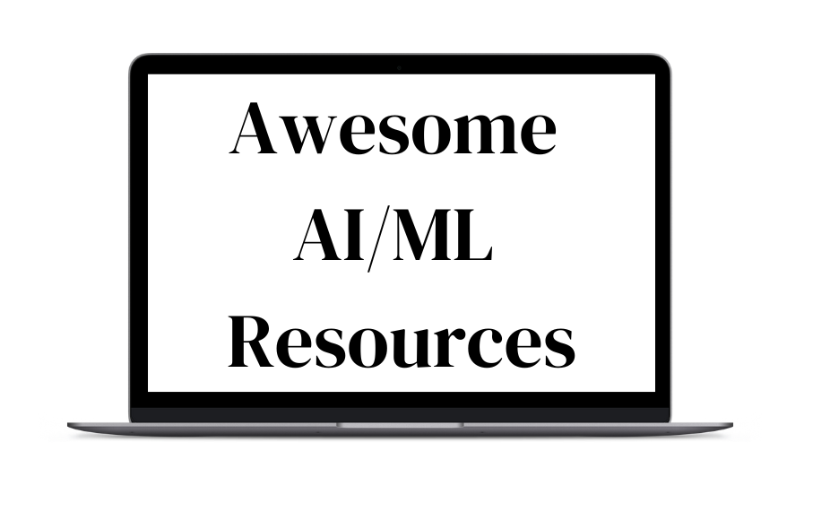

  

This repository contains free resources and a roadmap to learn Machine Learning and Artificial Intelligence in 2025.
该存储库包含免费资源和 2025 年学习机器学习和人工智能的路线图。
Subscribe to the [AI Engineer Newsletter](https://www.aimlengineer.io/) and get a **free AI/ML roadmap** in your inbox.
订阅 [AI 工程师通讯](https://www.aimlengineer.io/) 并在您的收件箱中获取免费的 AI/ML 路线图 。

## 📌 AI/ML Key Concepts AI 关键概念
- [Supervised Learning  监督学习](https://medium.com/@kodeinkgp/supervised-learning-a-comprehensive-guide-7032b34d5097)
- [Unsupervised Learning  无监督学习](https://cloud.google.com/discover/what-is-unsupervised-learning?hl=en#what-is-unsupervised-learning)
- [Reinforcement Learning  强化学习](https://spinningup.openai.com/en/latest/user/introduction.html#what-this-is)
- [Deep Learning  深度学习](https://www.datacamp.com/tutorial/tutorial-deep-learning-tutorial)
- [Natural Language Processing (NLP)自然语言处理（NLP）](https://medium.com/@ageitgey/natural-language-processing-is-fun-9a0bff37854e)
- [Computer Vision  计算机视觉](https://www.geeksforgeeks.org/computer-vision/)
- [Generative adversarial networks (GANs) 生成对抗网络（GAN）](https://aws.amazon.com/what-is/gan/)
- [Dimensionality Reduction 降维](https://scikit-learn.org/stable/modules/decomposition.html)  
- [Clustering Algorithms  聚类算法](https://scikit-learn.org/stable/modules/clustering.html) 
- [Bayesian Inference  贝叶斯推断](https://www.statlect.com/fundamentals-of-statistics/Bayesian-inference#:~:text=Bayesian%20inference%20is%20a%20way,that%20could%20generate%20the%20data.)
- [Time Series Analysis  时间序列分析](https://otexts.com/fpp3/) 
- [Self-Supervised Learning 自监督学习](https://lilianweng.github.io/posts/2021-05-31-self-supervised-learning/)

## 🛠️ AI/ML Building Blocks  AI/ML 构建模块
- [Linear Algebra for Machine Learning 机器学习的线性代数](https://ocw.mit.edu/courses/mathematics/18-06-linear-algebra-spring-2010/) 
- [Probability & Statistics 概率与统计](https://www.youtube.com/watch?v=2MuDZIAzBMY&list=PLoROMvodv4rOpr_A7B9SriE_iZmkanvUg)
- [Calculus for Optimization 最优化微积分](https://www.khanacademy.org/math/multivariable-calculus)
- [Python for Machine Learning Python 机器学习](https://www.coursera.org/learn/ai-python-for-beginners)
- [Optimization Techniques 优化技术](https://www.geeksforgeeks.org/optimization-algorithms-in-machine-learning/)
- [Data Preprocessing & Feature Engineering 数据预处理和特征工程](https://www.geeksforgeeks.org/what-is-feature-engineering/)
- [Model Evaluation & Metrics 模型评估与指标](https://scikit-learn.org/stable/modules/model_evaluation.html)
- [Regularization Techniques 正则化技术](https://www.geeksforgeeks.org/regularization-in-machine-learning/)
- [Loss Functions 损失函数](https://www.datacamp.com/tutorial/loss-function-in-machine-learning)
- [Activation Functions 激活函数](https://ml-cheatsheet.readthedocs.io/en/latest/activation_functions.html)
- [Hyperparameter Tuning 超参数调整](https://www.geeksforgeeks.org/hyperparameter-tuning/)

## 👨🏽‍💻 AI/ML Roles  AI/ML 角色
- [Machine Learning Engineer 机器学习工程师](https://www.coursera.org/articles/what-is-machine-learning-engineer)
- [Data Scientist 数据科学家](https://www.coursera.org/articles/what-is-a-data-scientist)
- [Software Engineer (AI) 软件工程师（人工智能）](https://www.coursera.org/articles/ai-engineer)
- [ML/AI Platform Engineer 机器学习/人工智能平台工程师](https://ml-ops.org/)
- [ML/AI Infrastructure Engineer 机器学习/人工智能基础设施工程师](https://www.databricks.com/glossary/mlops)
- [Framework Engineer 框架工程师](https://careers.qualcomm.com/careers/job/446698240161)
- [Solution Architect 解决方案架构师](https://www.coursera.org/articles/solutions-architect)
- [Developer Advocate  开发倡导者](https://www.freecodecamp.org/news/what-the-heck-is-a-developer-advocate-87ab4faccfc4/)
- [Solutions Engineer 解决方案工程师](https://www.coursera.org/articles/solutions-engineer)
- [Applied Research Scientist 应用研究科学家](https://www.indeed.com/career-advice/finding-a-job/data-scientist-vs-research-scientist-vs-applied-scientist)
- [Research Engineer 研究工程师](https://www.indeed.com/career-advice/finding-a-job/research-engineers)
- [Research Scientist 研究科学家](https://www.coursera.org/articles/research-scientist)

## 🚗 AI/ML Roadmap AI/ML 路线图
1. Learn Python and Core Libraries   学习 Python 和核心库
   - [Intro Python Python 简介](https://cs50.harvard.edu/python/2022/) 
   - [Advanced Python 高级 Python](https://www.edx.org/learn/artificial-intelligence/harvard-university-cs50-s-introduction-to-artificial-intelligence-with-python)
   - [NumPy: Numerical computing and arrays NumPy：数值计算和数组](https://numpy.org/devdocs/user/quickstart.html) 
   - [Pandas: Data manipulation and analysis Pandas：数据处理和分析](https://www.w3schools.com/python/pandas/default.asp) 
   - [Matplotlib & Seaborn: Data visualization Matplotlib 和 Seaborn：数据可视化](https://matplotlib.org/stable/tutorials/index.html) 
   - [scikit-learn: Implement ML algorithms scikit-learn：实现机器学习算法](https://scikit-learn.org/1.4/tutorial/index.html)

2. Build a Strong Math Foundation 建立坚实的数学基础
   - [Linear Algebra 线性代数](https://ocw.mit.edu/courses/mathematics/18-06-linear-algebra-spring-2010/) 
   - [Probability & Statistics 概率与统计](https://web.stanford.edu/class/stats116/syllabus.html)
   - [Calculus 微积分](https://www.khanacademy.org/math/multivariable-calculus)

3. Learn Machine Learning Fundamentals 学习机器学习基础知识
   - [Google Machine Learning Crash Course 谷歌机器学习速成课程](https://developers.google.com/machine-learning/crash-course) 
   - [Machine Learning by Andrew Ng 吴恩达 (Andrew Ng) 的《机器学习》](https://www.coursera.org/learn/machine-learning)
   - [Read Hundred-Page ML Book 阅读百页机器学习书籍](http://ema.cri-info.cm/wp-content/uploads/2019/07/2019BurkovTheHundred-pageMachineLearning.pdf)

4. Build Practical Experience & Projects 积累实践经验和项目
   - [Hands-On Machine Learning with Scikit-Learn, Keras, and TensorFlow 使用 Scikit-Learn、Keras 和 TensorFlow 进行机器学习实践](https://www.oreilly.com/library/view/hands-on-machine-learning/9781492032632/)
   - [Practical Deep Learning for Coders 程序员的实用深度学习](https://course.fast.ai/)  
   - [Structured Machine Learning Projects 结构化机器学习项目](https://www.coursera.org/learn/machine-learning-projects)
   - [Build GPT 构建 GPT](https://www.youtube.com/watch?v=kCc8FmEb1nY&t=1331s) 
   
5. Deepen Knowledge in Specialized Areas  深化专业领域知识
   - [Natural Language Processing 自然语言处理](https://huggingface.co/learn/nlp-course/chapter1/1)
   - [Reinforcement Learning 强化学习](https://huggingface.co/learn/deep-rl-course/unit0/introduction)
   - [Computer Vision 计算机视觉](https://www.kaggle.com/learn/computer-vision)
   - [Deep Learning  深度学习](https://www.youtube.com/watch?v=vT1JzLTH4G4&list=PLSVEhWrZWDHQTBmWZufjxpw3s8sveJtnJ&index=1)
   - [Transformers 架构](https://huggingface.co/learn/nlp-course/chapter1/1)

6. Learn about MLOps 了解 MLOps
   - [Intro to MLOps MLOps 简介](https://ml-ops.org/)
   - [Three levels of ML 机器学习的三个级别](https://ml-ops.org/content/three-levels-of-ml-software)
   - [Fullstackdeeplearning 全栈深度学习](https://fullstackdeeplearning.com/course/2022/)
   
7. Read Research Papers 阅读研究论文
   - [ArXiv for Research Papers ArXiv研究论文](https://arxiv.org/)

8. Prepare for AI/ML Job Interviews 准备 AI/ML 工作面试
   - [Introduction to Machine Learning Interviews 机器学习面试入门](https://huyenchip.com/ml-interviews-book/)
   - [ML Interviews MVP 机器学习面试 MVP](https://github.com/khangich/machine-learning-interview) 
   - [Designing Machine Learning Systems 设计机器学习系统](https://www.oreilly.com/library/view/designing-machine-learning/9781098107956/)

## 📚 Courses 课程
- [Machine Learning by Andrew Ng (Coursera) 机器学习 作者：Andrew Ng (Coursera)](https://www.coursera.org/learn/machine-learning)
- [AI For Everyone by Andrew Ng (Coursera) 人工智能为每个人作者：Andrew Ng (Coursera)](https://www.coursera.org/learn/ai-for-everyone)
- [Deep Learning Specialization (Coursera) 深度学习专业化（Coursera）](https://www.coursera.org/specializations/deep-learning)
- [Machine Learning with Python (edX - IBM) 使用 Python 进行机器学习 (edX - IBM)](https://www.edx.org/course/machine-learning-with-python-a-practical-introduct)
- [Reinforcement Learning Specialization (Coursera) 强化学习专业化（Coursera）](https://www.coursera.org/specializations/reinforcement-learning)
- [CS231n: Convolutional Neural Networks for Visual Recognition (Stanford) CS231n：用于视觉识别的卷积神经网络（斯坦福大学）](https://www.youtube.com/watch?v=vT1JzLTH4G4&list=PLSVEhWrZWDHQTBmWZufjxpw3s8sveJtnJ&index=1)
- [RL Course by David Silver David Silver 的 RL 课程](https://www.youtube.com/watch?v=2pWv7GOvuf0&list=PLqYmG7hTraZDM-OYHWgPebj2MfCFzFObQ)
- [Natural Language Processing with Deep Learning (Stanford - CS224n) 自然语言处理与深度学习（斯坦福大学 - CS224n）](https://www.youtube.com/watch?v=rmVRLeJRkl4&list=PLoROMvodv4rMFqRtEuo6SGjY4XbRIVRd4&index=1)
- [Fast.ai’s Practical Deep Learning for Coders Fast.ai 为程序员提供的实用深度学习](https://course.fast.ai/)

## 🎓 Certifications 认证
- [AWS Certified Machine Learning Engineer – Associate AWS 认证机器学习工程师 – 助理](https://aws.amazon.com/certification/certified-machine-learning-engineer-associate/)
- [Microsoft Certified: Azure AI Engineer Associate Microsoft 认证：Azure AI 工程师助理](https://learn.microsoft.com/en-us/certifications/azure-ai-engineer/)
- [Stanford AI and Machine Learning Certificate 斯坦福人工智能和机器学习证书](https://online.stanford.edu/programs/artificial-intelligence-professional-program)

## 📕 Books 书籍
- [Hands-On Machine Learning with Scikit-Learn, Keras, and TensorFlow 使用 Scikit-Learn、Keras 和 TensorFlow 进行机器学习实践](https://www.oreilly.com/library/view/hands-on-machine-learning/9781492032632/)
- [AI Engineering: Building Applications with Foundational Models 人工智能工程：使用基础模型构建应用程序](https://www.oreilly.com/library/view/ai-engineering/9781098166298/)
- [Introduction to Machine Learning Interviews 机器学习面试入门](https://huyenchip.com/ml-interviews-book/)
- [Designing Data Intensive Applications 设计数据密集型应用程序](https://www.oreilly.com/library/view/designing-data-intensive-applications/9781491903063/)
- [Designing Machine Learning Systems 设计机器学习系统](https://www.oreilly.com/library/view/designing-machine-learning/9781098107956/)
- [Deep Learning 深度学习](https://www.deeplearningbook.org/)

## 🛠️ Tools & Frameworks 工具和框架
- [PyTorch](https://www.youtube.com/watch?v=V_xro1bcAuA)
- [TensorFlow](https://www.youtube.com/watch?v=tPYj3fFJGjk)
- [Scikit-Learn](https://scikit-learn.org/stable/getting_started.html)
- [XGBoost](https://xgboost.readthedocs.io/en/latest/)
- [Keras](https://keras.io/getting_started/)
- [Perplexity](https://www.perplexity.ai/)
- [CursorAI](https://www.cursor.com/)
- [Whisper](https://github.com/openai/whisper) 

## AI/ML Research Blogs  AI/ML 研究博客
- [OpenAI Blog](https://openai.com/news/)
- [Google DeepMind 谷歌DeepMind](https://deepmind.google/discover/blog/)
- [Google Research 谷歌研究](https://research.google/blog/)
- [Apple ML Research 苹果ML研究](https://machinelearning.apple.com/)
- [Amazon Science 亚马逊科学](https://www.amazon.science/blog?f0=0000016e-2fb1-d205-a5ef-afb9d52c0000&f0=0000016e-2ff0-da81-a5ef-3ff057f10000&f0=0000016e-2ff1-d205-a5ef-aff9651e0000)
- [Microsoft AI 微软人工智能](https://www.microsoft.com/en-us/ai/blog/)
- [Meta AI Blog Meta人工智能博客](https://ai.meta.com/blog/?page=1)

## AI/ML Applied Blogs AI/ML Applied Blogs  AI/ML 应用博客
- [AWS Machine Learning Blog AWS 机器学习博客](https://aws.amazon.com/blogs/machine-learning/)
- [NVIDIA - Deep Learning Blog NVIDIA - 深度学习博客](https://blogs.nvidia.com/blog/category/deep-learning/)
- [AirBnB Engineering, AI & ML AirBnB 工程、人工智能和机器学习](https://medium.com/airbnb-engineering/ai/home)
- [Spotify Engineering Spotify 工程](https://engineering.atspotify.com/)
- [Uber Engineering 优步工程](https://eng.uber.com/category/articles/ai/)
- [Netflix Blog Netflix 博客](https://netflixtechblog.com/)
- [Google AI 谷歌人工智能](https://blog.google/technology/ai/)

## AI/ML Problems 人工智能/机器学习问题
### Easy 简单
- [Matrix times Vector 矩阵乘以向量](https://www.deep-ml.com/problems/1)
- [Titanic: Machine Learning from Disaster 泰坦尼克号：从灾难中学习机器学习](https://www.kaggle.com/c/titanic)
- [Predicting House Prices Using Linear Regression 使用线性回归预测房价](https://www.kaggle.com/competitions/home-data-for-ml-course)

### Medium 中级 
- [Single Neuron 单个神经元](https://www.deep-ml.com/problems/24)
- [K-Means Clustering  K 均值聚类](https://www.deep-ml.com/problems/17)
- [Predicting Loan Default Risk 预测贷款违约风险](https://www.kaggle.com/c/home-credit-default-risk)
- [Sentiment Analysis on Movie Reviews 电影评论的情绪分析](https://www.kaggle.com/c/sentiment-analysis-on-movie-reviews)

### Hard 困难
- [Decision Tree Learning 决策树学习](https://www.deep-ml.com/problems/20)
- [Implement a Simple RNN with Backpropagation 使用反向传播实现简单的 RNN](https://www.deep-ml.com/problems/62)
- [Generative Adversarial Networks (GANs) for Image Synthesis 用于图像合成的生成对抗网络（GAN）](https://www.kaggle.com/c/generative-dog-images)

## ⚡️ AI/ML Communities  AI/ML 社区
- [r/LearnMachineLearning](https://www.reddit.com/r/learnmachinelearning/)
- [Chip Huyen MLOps Discord](https://discord.com/invite/dzh728c5t3)
- [Hugging Face Discord](https://discord.com/invite/hugging-face-879548962464493619)

## 📺 Youtube Channels YouTube 频道
- [Stanford Online](https://www.youtube.com/watch?v=jGwO_UgTS7I&list=PLoROMvodv4rMiGQp3WXShtMGgzqpfVfbU)
- [Andrej Karpathy](https://www.youtube.com/watch?v=VMj-3S1tku0&list=PLAqhIrjkxbuWI23v9cThsA9GvCAUhRvKZ)
- [FreeCodeCamp](https://www.youtube.com/watch?v=i_LwzRVP7bg)
- [3Blue1Brown](https://www.youtube.com/watch?v=aircAruvnKk&list=PLZHQObOWTQDNU6R1_67000Dx_ZCJB-3pi)
- [Sentdex](https://www.youtube.com/watch?v=OGxgnH8y2NM&list=PLQVvvaa0QuDfKTOs3Keq_kaG2P55YRn5v)

## 📩 Newsletters 新闻资讯
- [The AI Engineer](https://aimlengineer.io)

## 📃 Must Read Papers 必读论文
- [Attention Is All You Need (Google) 你只需要注意力（谷歌）](https://arxiv.org/pdf/1706.03762)
- [DeepSeek R1: Incentivizing Reasoning Capability in LLMs DeepSeek R1：激励法学硕士 (LLM) 中的推理能力](https://arxiv.org/pdf/2501.12948) 
- [Monolith: Real Time Recommendation System (TikTok/ByteDance) Monolith：实时推荐系统（字节跳动）](https://arxiv.org/pdf/2209.07663)
- [BERT: Pre-training of Deep Bidirectional Transformers for Language Understanding BERT：用于语言理解的深度双向 Transformer 预训练](https://arxiv.org/pdf/1810.04805)
- [Understanding Deep Learning Requires Rethinking Generalization 理解深度学习需要重新思考泛化](https://arxiv.org/pdf/1611.03530)
- [Playing Atari with Deep Reinforcement Learning 利用深度强化学习玩 Atari](https://arxiv.org/pdf/1312.5602)
- [Distilling the Knowledge in a Neural Network 提炼神经网络中的知识](https://arxiv.org/pdf/1503.02531)
- [Open AI Key Papers in Deep RL Open AI 深度强化学习关键论文](https://spinningup.openai.com/en/latest/spinningup/keypapers.html)
